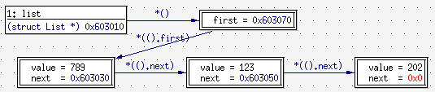
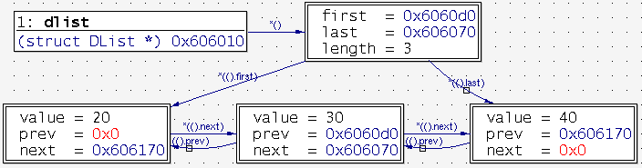

# Practicum C: Dynamisch geheugenbeheer

Het doel van dit practicum is om wat dieper in te gaan op belangrijke C concepten waarmee jullie tijdens de eerste oefenzitting al kennis gemaakt hebben: *pointers* en *dynamisch geheugenbeheer*. Een goede oefening om hiermee beter vertrouwd te worden, is om een C API te implementeren die verantwoordelijk is voor het dynamisch toekennen en vrijgeven van geheugen. Tijdens de implementatie zullen jullie ook de kans krijgen om met een belangrijke gegevensstructuur te werken, namelijk de *tweevoudig gelinkte lijst*.

## Afspraken

### Gedragscode

De practica worden gequoteerd, en het examenreglement is dan ook van toepassing. Soms is er echter wat onduidelijkheid over wat toegestaan is en niet inzake samenwerking bij opdrachten zoals deze.

De oplossing en/of programmacode die ingediend wordt moet volledig het resultaat zijn van werk dat je zelf gepresteerd hebt. Je mag je werk uiteraard bespreken met andere studenten, in de zin dat je praat over algemene oplossingsmethoden of algoritmen, maar de bespreking mag niet gaan over specifieke code of verslag tekst die je aan het schrijven bent, noch over specifieke resultaten die je wenst in te dienen. Als je het met anderen over je practicum hebt, mag dit er dus *nooit* toe leiden, dat je op om het even welk moment in het bezit bent van een geheel of gedeeltelijke kopie van het opgeloste practicum of verslag van anderen, onafhankelijk van of die code of verslag nu op papier staat of in elektronische vorm beschikbaar is, en onafhankelijk van wie de code of het verslag geschreven heeft (medestudenten, eventueel uit andere studiejaren, volledige buitenstaanders, internetbronnen, e.d.). Dit houdt tevens ook in dat er geen enkele geldige reden is om je code of verslag door te geven aan medestudenten, noch om dit beschikbaar te stellen via publiek bereikbare directories of websites. 

Elke student is verantwoordelijk voor de code en het werk dat hij of zij indient. Als tijdens de beoordeling van het practicum er twijfels zijn over het feit of het practicum zelf gemaakt is (bv. gelijkaardige code, of oplossingen met andere practica), zal de student gevraagd worden hiervoor een verklaring te geven. Indien dit de twijfels niet wegwerkt, zal er worden overgegaan tot het melden van een onregelmatigheid, zoals voorzien in het [onderwijs- en examenreglement](https://www.kuleuven.be/onderwijs/oer/) van de KU Leuven.

Alle inzendingen worden automatisch met elkaar vergeleken met behulp van plagiaatsoftware voor code. Deze software geeft een score van gelijkaardigheid aan projecten. De projecten die het meest op elkaar lijken worden nadien manueel nagekeken.

### Forum

Alle vragen over het practicum, *inclusief vragen aan medestudenten*, moeten gesteld worden via het **discussieforum** op  [Toledo](https://toledo.kuleuven.be). Alle antwoorden van assistenten op het discussieforum worden beschouwd als **deel van de opgave** en kunnen bijgevolg aanvullingen of correcties bevatten. Zorg ervoor dat je deze posts leest!

Tip: open het forum en klik bovenaan op *subscribe* om een e-mail te krijgen wanneer nieuwe threads worden toegevoegd aan het forum.

## Opdracht

### Inleiding

#### Gelinkte lijsten

Een *gelinkte lijst* is een gegevensstructuur die vaak gebruik wordt om lijsten voor te stellen. Een gelinkte lijst is zeer flexibel omdat die het mogelijk maakt om op een efficiënte manier elementen toe te voegen en te verwijderen op eender welke positie in de lijst. Een ander voordeel is dat de grootte van een gelinkte lijst dynamisch (terwijl het programma wordt uitgevoerd) kan veranderen: er staat met andere woorden geen limiet op het aantal elementen dat je aan de lijst kan toevoegen. 

Dit staat in schril contrast met een *array*. Een array (of rij) is namelijk een ander soort gegevensstructuur die, net zoals een lijst, gebruikt kan worden om meerdere elementen van iets bij te houden maar die wel gekenmerkt wordt door een vaste grootte. Twee belangrijke nadelen van het werken met arrays is dat de programmeur op voorhand (terwijl het programma geschreven wordt) het maximaal aantal elementen moet kennen dat een array kan bevatten en dat het helemaal niet zo efficiënt is om elementen toe te voegen of te verwijderen op willekeurige posities in de rij.

Een manier om in C een gelinkte lijst voor te stellen is door gebruik te maken van twee *structs*, namelijk`struct list` en`struct element`. De eerste *struct* wordt dan gebruikt als het type dat de volledige lijst voorstelt terwijl de tweede *struct* gebruikt wordt als het type van een element in de lijst. Elk element bevat een "payload", in dit geval het geheel getal `value` en een *pointer* naar het volgende element.

```c
struct list
{
    struct list_element *first;
};

struct list_element
{
    int value;
    struct list_element *next;
};
```

Het einde van een lijst wordt voorgesteld door een `NULL` pointer (adres 0x00). Deze waarde wordt gedefinieerd door de standaard C header *stdlib.h*.

Onderstaande afbeelding is een weergave van een enkelvoudig gelinkte lijst met behulp van het programma *ddd*, een grafische front end voor de [GDB](https://www.gnu.org/software/gdb/) debugger.  Op het moment van de weergave bevatte de lijst in kwestie 3 elementen: 789, 123 en 202.





Een nadeel van enkelvoudig gelinkte lijsten is dat we deze lijsten slechts in één richting kunnen doorlopen. Om een lijst in omgekeerde volgorde te doorlopen moet de lijst zijn laatste element `last` kennen. Verder zal elk element naast de `next` pointer ook een `prev` pointer moeten bijhouden om zijn voorganger te kennen. Dit resulteert in de volgende gegevensstructuren:


```c
struct dlist
{
    struct dlist_element *first;
    struct dlist_element *last;
};

struct dlist_element
{
    int value;
    struct dlist_element *prev;
    struct dlist_element *next;
};
```

Onderstaande afbeelding is een weergave van een tweevoudig gelinkte lijst met 3 elementen: 789, 123, 202.




#### Dynamisch geheugenbeheer

Het dynamisch (tijdens uitvoering) toekennen van geheugen komt van pas wanneer het moeilijk te voorspellen valt hoeveel geheugen een programma nodig zal hebben. Dankzij dynamische geheugentoekenning kan een programma vermijden onnodig veel geheugen te reserveren door op een beter geïnformeerde manier te bepalen hoeveel geheugen er werkelijk nodig is. Dynamische geheugentoekenning impliceert ook dat het dynamisch toegekende geheugen terug zal moeten worden vrijgegeven wanneer het niet meer wordt gebruikt om te vermijden dat het volledige geheugen van een computersysteem lekt en zelfs volledig uitgeput geraakt. Het dynamisch toekennen en vrijgeven van geheugen wordt *dynamisch geheugenbeheer* genoemd.

Dynamisch geheugenbeheer is één van de moeilijkere aspecten van programmeren in C en is de oorzaak van vele problemen in C programma 's. In tegenstelling tot andere talen zoals Python of Java, die deze taak volledig uit handen van de programmeur nemen, is de programmeur zelf verantwoordelijk voor het beheer van dynamisch geheugen. Performantie is de belangrijkste reden om deze taak niet te automatiseren.

De C header `stdlib.h`, een onderdeel van de standaard C bibliotheek, bevat de functie `void *malloc(size_t size)` die gebruikt wordt om een deel van het beschikbare dynamische geheugen toe te kennen. Deze functie zal trachten de gevraagde hoeveelheid geheugen toe te kennen en zal bij een succesvolle toekenning een *pointer* naar dat toegekende geheugen teruggeven. Wanneer het toekennen faalt, is het resultaat van de functie de `NULL` pointer. 

Om eerder toegekend geheugen terug vrij te geven, voorziet C de functie `void free(void *ptr)` die een pointer naar met `malloc` toegekend geheugen verwacht en het geheugen terug ter beschikking stelt voor andere doeleinden.

#### Dynamisch geheugen

Het gebied in het geheugen van een computer dat gebruikt wordt voor het dynamisch toekennen van geheugen aan computerprocessen wordt **de heap** genoemd. De functie `malloc` zal dus op zoek moeten gaan naar een aaneengesloten deel van de heap dat voldoende groot is om aan de vraag van het programma te voldoen en zal, indien er zo een aaneengesloten deel gevonden wordt, op één of andere manier de boekhouding moeten bijhouden en registreren dat dit deel van het geheugen in gebruik is als het effectief wordt toegekend aan het programma. De functie `free` zal diezelfde boekhouding dan weer moeten aanpassen en ervoor zorgen dat het eerder toegekend geheugen opnieuw door `malloc` gebruikt mag worden.

Op computersystemen met een besturingssysteem zal `malloc` typisch met het besturingssysteem samenwerken om ervoor te zorgen dat de heap voldoende groot is om aan de noden van het programma te voldoen. 

### Opgave

Tijdens dit practicum zullen jullie eenvoudige versies van de standaard C functies `malloc` en `free`moeten programmeren.  Hierbij zullen jullie moeten nadenken hoe jullie de volgende verantwoordelijkheden zullen implementeren:

- het initialiseren van het dynamisch geheugen en de bijbehorende boekhouding
- het beheren van een lijst van beschikbare geheugenblokken
- het beheren van een lijst van toegekende geheugenblokken
- het zoeken naar een aaneengesloten deel van het geheugen in de lijst van beschikbare geheugenblokken dat groot genoeg is om aan een toekenningsverzoek te voldoen
- bij het toekennen van geheugen, de overeenkomstige blokken verwijderen uit de lijst van beschikbare geheugenblokken en deze toevoegen aan de lijst van toegekende geheugenblokken
- bij het vrijgeven van eerder toegekend geheugen, de overeenkomstige blokken verwijderen uit de lijst van toegekende geheugenblokken en deze terug toevoegen aan de lijst van beschikbare geheugenblokken.

Om dit tot een goed einde te brengen, zullen jullie ook gebruik moeten maken van een gegevensstructuur die gebaseerd is op een tweevoudig gelinkte lijst waarvoor jullie de nodige operaties zullen moeten implementeren.

Via GitHub Classroom hebben hebben jullie toegang tot een eigen private Git repository die alle nodige bestanden bevat om aan je practicum te beginnen. De meegeleverde bestanden mogen niet verwijderd worden. Het is uiteraard wel toegestaan om je eigen bestanden toe te voegen.

De repository kan je klonen met het commando:

```bash
git clone https://www.github.com/informatica-werktuigen/project-c-dynamic<username>.git
```

De repository bevat volgende bestanden:

- [memory_priv.h](memory_priv.h)
Het header bestand met de declaraties van de interne functies die jullie van een implementatie moeten voorzien. Hierin vinden jullie naast de configuratie van de heap, ook de definitie van de gegevensstructuren die jullie moeten gebruiken om de interne boekhouding van het geheugengebruik bij te houden. Verder definieert dit bestand ook de interne variabelen die gebruikt worden om de heap voor te stellen en om de boekhouding te doen. **Aan dit bestand mag niets veranderd worden.**

- [memory.h](memory.h)
Het header bestand met de declaraties van de publieke functies die jullie van een implementatie moeten voorzien. **Aan dit bestand mag niets veranderd worden.**

- [main.c](main.c)
Bevat de *main* functie die het dynamisch geheugen initialiseert en die de functie oproept die jullie implementatie uitvoerig zal testen. Hierin vinden jullie ook voorbeeld code hoe dynamisch geheugen toe te wijzen en vrij te geven aan de hand van de publieke functies die memory.h ter beschikking stelt. **Aan dit bestand mag eveneens niet veranderd worden.**

- [memory.c](memory.c)
Bevat lege definities van alle functies die jullie van een implementatie moeten voorzien. De implementatie van een aantal hulpfuncties die jullie van ons krijgen is hier ook terug te vinden. Boven de signatuur van elke functie staat in commentaar heel precies uitgelegd wat er van de functies verwacht wordt. Baseer je op deze commentaar bij het implementeren van de functies. Je mag hier eventueel hulpfuncties aan toevoegen, maar het prototype van bestaande functies mag niet veranderd worden. De functienaam, het return type en de argumenten van deze functies mogen dus niet aangepast worden.

- [test.c](test.c)
Bevat de functie *memory_test* die nuttige informatie print en een aantal eenvoudige testen uitvoert. Merk op dat deze testen zeker niet volledig zijn. Het kan zijn dat deze testen lukken, maar dat er nog altijd een fout in jullie code zit. We raden jullie dan ook sterk aan om eigen testen toe te voegen aangezien dit jullie zal helpen om sneller fouten uit jullie implementatie te halen.

Je kan deze bestanden compileren aan de hand van het volgende commando:

```bash
gcc -g -std=c99 -Wall -Wno-unused-function -Werror main.c memory.c -o main
```

Voor meer informatie over de argumenten die aan *GCC* worden meegegeven, verwijzen we jullie naar de Linux man pages (`man gcc`).

Wanneer het programma met succes gecompileerd is, kan je het starten door de volgende regel in te voeren:

```bash
./main
```

Om te vermijden dat je de bovenstaande commando' s elke keer weer opnieuw moet intypen, hebben we een **Makefile** bestand toegevoegd. Concreet betekent dit dat je in plaats van de *gcc* regel in te voeren en het programma handmatig moet oproepen, eenvoudigweg `make run` hoeft te typen. Het programma *make* zal er dan voor zorgen dat 1) alleen de gewijzigde bestanden opnieuw gecompileerd worden, dat 2) alles correct samengevoegd wordt in een uitvoerbaar programma en dat 3) het programma wordt uitgevoerd.

De rest van de opgave zal wat dieper ingaan op een aantal aspecten van de opgave.

#### C99

De code die jullie schrijven moet compatibel zijn met de ISO/IEC 9899:1999 C standaard, ook wel C99 genoemd. De *GCC* optie `std=c99`zal dit afdwingen. Met C99 hebben jullie toegang tot het header bestand *stdint.h* dat het type `uint8_t` definieert, een type voor getallen die 8 bits groot zijn. Wij zullen het `uint8_t` type gebruiken om bytes voor te stellen. Het header bestand *stdbool.h* definieert het Booleaanse type `bool` en de bijbehorende Booleaanse waarden `false` en `true`.

Het header bestand *assert.h* maakt de `assert` macro beschikbaar. Deze macro is zeer nuttig om tijdens het maken van jullie project ervoor te zorgen dat de invarianten, de precondities en de postcondities van jullie code gehandhaafd blijven. Het bestand [memory.c](memory.c) bevat al code die hiervan gebruik maakt.


#### De heap

We zullen onze eigen heap intern voorstellen door een array van HEAP_SIZE bytes groot. We verdelen de heap onder in blokken die een grootte hebben van BLOCK_SIZE bytes. Er zijn in totaal NUMBER_OF_BLOCKS (HEAP_SIZE / BLOCK_SIZE) blokken dynamisch geheugen. De constanten HEAP_SIZE, BLOCK_SIZE en NUMBER_OF_BLOCKS zijn gedefinieerd in het header bestand [memory_priv.h](memory_priv.h).

Om bij te houden welke delen van de heap beschikbaar zijn voor toekenning zullen jullie werken met een tweevoudig gelinkte lijst van deze geheugenblokken, die we de **free list** zullen noemen. Het doel van deze free list is om de beschikbare blokken van de heap op zo 'n manier met elkaar te verbinden dat elk element in de lijst wijst naar het element waarvan het adres het eerste adres van het  vorige niet toegekende geheugenblok is (of NULL bij het eerste element van de lijst) en naar het element waarvan het adres het eerste adres is van het volgende niet toegekende geheugenblok (of NULL bij het laatste element van de lijst). 

Door te werken met een gelinkte lijst, kunnen de operaties voor het toekennen en vrijgeven van het geheugen eenvoudig geïmplementeerd worden. De geheugenblokken die reeds in gebruik zijn (en dus niet beschikbaar voor toekenning) worden eveneens op een gelijkaardige manier in een tweevoudig gelinkte lijst bijgehouden, de **used list**. 

Zowel de free list als de used list zijn van het type `struct list`. Dit struct type is als volgt gedefinieerd in [memory_priv.h](memory_priv.h):

```c
struct list
{
  struct block *first;
  struct block *last;
};

struct block
{
  uint8_t *address;
  uint32_t alloc_count;
  struct block *prev;
  struct block *next;
};
```

Verder voorzien we een poel van NUMBER_OF_BLOCKS `struct block` blokken die gebruikt wordt om de free list te initialiseren.

Volgende **invarianten** zijn van toepassing op deze representatie:

- Een blok uit de poel van blokken is ofwel een element van de used list ofwel een element van de free list.

- De used list en de free list zijn gesorteerd volgens toenemend adres.

- Het verschil van de adressen van elk blok en zijn opvolger is een veelvoud van BLOCK_SIZE.

- De waarde van alloc_count in elk blok dat een element is van de free list moet nul zijn.

- De waarde van alloc_count in elk blok in de used list dat het eerste blok vertegenwoordigt van een toegewezen deel van het dynamisch geheugen is het aantal aaneengesloten blokken dat gebruikt wordt voor deze toekenning.

Het is belangrijk dat jullie deze voorstellingswijze begrijpen vooraleer jullie aan de slag kunnen gaan.  We verwijzen naar [memory_priv.h](memory_priv.h) en [memory.h](memory.h) voor meer details.

#### Interne API ([memory_priv.h](memory_priv.h))

Deze sectie geeft een kort overzicht van de operaties van de interne API die door jullie zullen geïmplementeerd moeten worden. Zie het bestand [memory.c](memory.c) voor een gedetailleerde beschrijving van elke functie. Om jullie op weg te helpen hebben we al een aantal functies geïmplementeerd.

We raden jullie aan om de volgorde van deze functies in het bestand [memory.c](memory.c) te volgen bij het maken van het practicum, aangezien deze min of meer geordend zijn volgens toenemende moeilijkheidsgraad.

```c
static void list_init(struct list *list);

static bool block_is_valid(const struct block *block);

static bool list_contains(const struct list *list, const struct block *block);

static uint32_t list_get_length(const struct list *list);

static void list_print(struct list *list, const char *title);

static void list_print_reverse(struct list *list, const char *title);

static struct block *list_find_block_by_address(const struct list *list,
                                                const uint8_t *address);

static bool blocks_are_contiguous(const struct block *left,
                                  const struct block *right);

static uint32_t required_number_of_contiguous_blocks(uint32_t size);

static bool has_number_of_contiguous_blocks(const struct block *block,
                                            uint32_t            count);

static void list_init_block(struct list  *list,
                            struct block *block,
                            uint8_t      *address);

static void list_insert_chain(struct list* list, struct block *block);

static uint32_t list_remove_chain(struct list  *list,
                                  struct block *block,
                                  uint32_t      block_count);
```

#### Publieke API ([memory.h](memory.h))

Deze sectie geeft een kort overzicht van de operaties van de publieke API die geïmplementeerd moeten worden. Zie het bestand [memory.c](memory.c) voor een gedetailleerde beschrijving van elke functie. Om jullie op weg te helpen hebben we de functie *memory_initialize* al geïmplementeerd. De implementatie van deze functie zal jullie ook helpen om de interne voorstelling van de heap en de bijbehorende boekhouding beter te begrijpen. **Bestudeer deze functie goed vooraleer aan de implementatie van de overige functies te beginnen!**

We raden jullie ook aan om eerst de private API te implementeren vooraleer jullie beginnen aan de publieke API. Bij de implementatie van de publieke API zullen jullie de functies van de private API kunnen gebruiken.

```c
void memory_initialize(void);

uint32_t memory_available(void);

uint32_t memory_used(void);

void *memory_allocate(uint32_t size);

bool memory_release(void *ptr);
```

## Indienen

Het practicum wordt ingediend met behulp van *Git*.

Je practicum moet **ten laatste op zondag 15 december 2019 om 23u59** ingeleverd worden. Alle wijzigingen aan jullie repository na deze datum zullen niet aanvaard worden, tenzij met puntenverlies.

De repository moet de bestanden [memory.h](memory.h), [memory_priv.h](memory_priv.h), [memory.c](memory.c), [test.c](test.c) en [main.c](main.c) bevatten. Denk eraan dat jullie de bestanden [memory.h](memory.h), [memory_priv.h](memory_priv.h) en [main.c](main.c) niet mogen aanpassen! Je oplossing zal gecontroleerd worden via het uitvoeren van een aantal automatische testen. Zorg er daarom voor dat je oplossing werkt in de PC klassen van gebouw 200A. Je mag tijdens het oplossen van je practicum uiteraard een andere compiler gebruiken maar wat je indient *moet* werken met *GCC*. Zo niet, wordt het niet bekeken.

Je kan een correcte inzending *controleren* door je eigen repository opnieuw te klonen in een tijdelijke folder. Indien alles correct is ingediend, zou de folder /tmp/project-c-dynamic na het uitvoeren van onderstaande commando 's je ingediende versie moeten bevatten.

```bash
$ cd /tmp
$ git clone https://www.github.com/informatica-werktuigen/project-c-dynamic<username>.git
$ cd project-c-dynamic
```

Je kan de inhoud van de repository uiteraard ook nakijken op de website van GitHub zelf.

**Kijk goed na of je alle bestanden correct hebt ingediend. Een foute inzending wordt gelijkgesteld aan laattijdige inzending!**

## Verdediging

De verdedigingen van het practicum zullen plaatshebben op **17 en 18 december.** De praktische planning en lokaalverdeling volgen later op [Toledo](https://toledo.kuleuven.be).

Op de verdediging krijgen jullie één uur de tijd om enkele aanpassingen of uitbreidingen te maken op basis van jullie ingediende oplossing. Hoe duidelijker jullie code is, hoe makkelijker het zal zijn om deze uitbreidingen te maken. Hierbij mag Internet gebruikt worden, *behalve* om te communiceren met medestudenten. Nadien krijgen jullie de tijd om de oplossing te tonen en uit te leggen aan een assistent.

De verdediging is een examenmoment, behandel dit ook zo. **Zorg ervoor dat je op tijd aanwezig bent op het aan jou toegekende moment.** Indien je om eender welke reden niet op tijd op de verdediging kan  geraken, neem dan zo snel mogelijk contact op met het assistententeam  zodat er gezocht kan worden naar een oplossing. *Niet komen opdagen op je verdediging, zonder enige verwittiging, zal resulteren in een nul op dit practicum*. Indien je door ziekte niet op je verdediging aanwezig kan zijn, bezorg je je ombudspersoon een doktersattest. Via de ombudspersoon kan dan een inhaalverdediging vastgelegd worden.

## Oefensessies

Tijdens de tweede en de derde oefensessie C, zullen jullie de kans krijgen om aan het practicum te werken en om vragen te stellen.

## Evaluatiecriteria

In deze sectie beschrijven we kort enkele criteria die we gebruiken om een score toe te kennen aan het practicum.

### Functionaliteit

In de eerste plaats wordt er gekeken naar een correcte, foutloze werking van je programma. Zorg ervoor dat alle functionaliteit die in de opgave gevraagd wordt aanwezig is ook in je programma. Je zal enkel kunnen slagen voor dit practicum als je werkende code oplevert.

We geven geen punten voor extra (ongevraagde) functionaliteit. Je mag eigen functionaliteit toevoegen, maar hier kan je geen punten mee winnen.

### Leesbaarheid code

Zorg ervoor dat je code leesbaar is!

Enkele tips:

- Gebruik duidelijke, verklarende namen voor alle variabelen en functies
- Maak veel gebruik van functies om je code op te delen. Deel lange  functies op in kleinere helper functies die je probleem stap voor stap  oplossen. Functionele decompositie zal je helpen om code te schrijven die leesbaar is.
- *Indenteer* je code! Vele editors hebben auto-formatting  functionaliteit. Maak daar gebruik van! Er is niets vervelender dan code te lezen met foute of geen indentatie.
- Maak gebruik van commentaar, maar enkel voor de stukken code die  slecht leesbaar zijn. Voeg deze commentaar dus pas toe nadat je alle  bovenstaande stappen hebt uitgevoerd en nog steeds merkt dat het stuk  code lastig te lezen is.
- Wees consequent met alle stijlkeuzes die je maakt. Indien je  bijvoorbeeld beslist om een accolade telkens op een nieuwe regel te  laten beginnen, doe dit dan voor het volledige document.

### Correcte inzending

Zorg ervoor dat je code correct en tijdig is ingediend via GitHub.

### Gebruik van informaticawerktuigen

We willen jullie er nog eens op wijzen dat één van de [doelstellingen](https://onderwijsaanbod.kuleuven.be/syllabi/n/G0Q30EN.htm#activetab=doelstellingen_idp1497552) van dit OPO is dat de student zelf aan de slag kan gaan met belangrijke werktuigen (tools) van de informatica. 

#### Versiebeheer

We hebben bij de verdediging van het vorige practicum vastgesteld dat *Git* onvoldoende gebruikt werd. Een programma zoals *Git* is echter één van de belangrijkste werktuigen waar je als informaticus mee zal moeten leren werken. Het is verstandig om regelmatig tijdens het maken van dit practicum de gewijzigde bestanden te committen en te pushen met *Git*. Zo heb je altijd een back-up van je code, kan je eerdere versies bekijken en kan je kijken wat er veranderd is over verschillende versies heen.

```bash
$ git add memory.c
$ git add test.c
$ git commit -m "Korte beschrijving van je wijzigingen"
$ git push
```

#### Tests

**Test je functies in detail tijdens de implementatie**. De meegeleverde testen in [test.c](test.c) zijn niet volledig. Schrijf dus ook je eigen testen en let vooral op randgevallen zoals wat te doen als er geen geheugen meer beschikbaar is om toe te kennen.

Wacht ook niet tot het einde om je functies te beginnen testen maar start zeker met het schrijven en uitvoeren van test code voor een functie van zodra je die functie geïmplementeerd hebt. Via deze werkwijze zal je sneller tot een werkend resultaat komen met minder fouten.

#### Debugger

Een debugger is eveneens een belangrijk werktuig waarmee je "in" een programma kan kijken terwijl het wordt uitgevoerd. Het kan je helpen om problemen met je implementatie makkelijker te identificeren. Daarom verwachten we ook dat jullie *gdb* of *ddd* kunnen gebruiken om je implementatie te debuggen.


